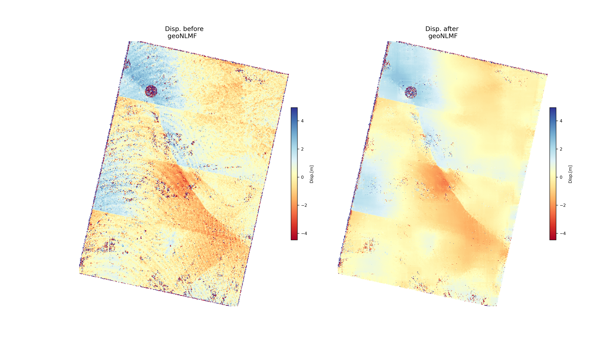
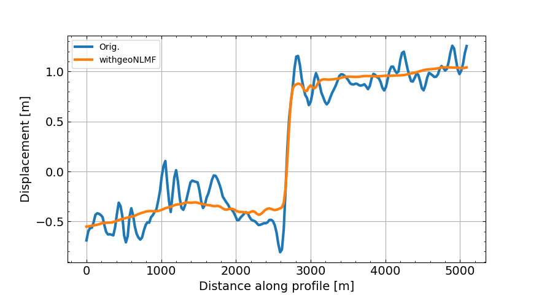
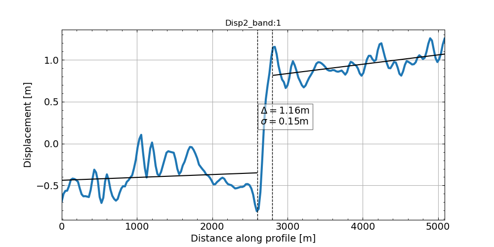
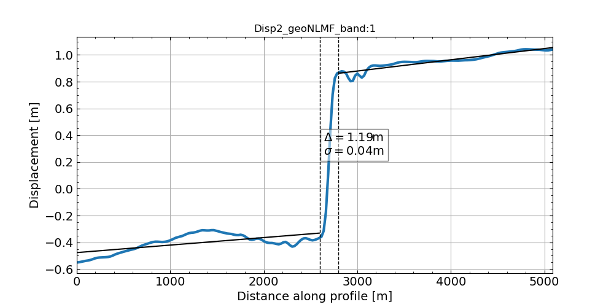

---
# Geospatial Non-Local Mean Filter (geoNLMF)

[Saif Aati](mailto:saif@caltech.edu) :  saif@caltech.edu

[Saif Aati](mailto:saifaati@gmail.com) :  saifaati@gmail.com

---

## **Overview**
This tool is a modified implementation of the Non-Local Means algorithm used for image denosing.
This algorithm has demonstrated an ability to preserve fine details while reducing additive white Gaussian noise.
The implementation provided here extends the method to filter and denoise geospatial displacement maps derived using 
image correlation technique.
The proposed package is a modified version of the algorithm proposed in [[1]](#1) and
an open-source version of the implementation in[[2]](#2).

## **Installation**

--------------
To install `geoNLMF` from source:
    
1- Install [geoRoutines](//github.com/SaifAati/geoRoutines.git) package.\
2- Set and activate `geoCosiCorr3D` environment.\
3- git clone [geoNLMF](https://github.com/SaifAati/geoNLMF.git) package.\
4- Install `geoNLMF`:

    pip install .

5- Create `geoNLMF` shared library:

In addition, of previously named tools, people willing to compile binaries from the source code will need to install the [cmake](www.cmake.org)
program.

Compiling process for Linux / MacOS X:
- enter 'geoNLMF/lib' directory : `cd geoNLMF`
- create a directory for the build's intermediate files, then enter it : `mkdir build & cd build`
- generate makefiles using cmake : `cmake ../`
- process compilation : `make install -j*cores number*` (ex.: `make install -j16`)

#### *Core requirements*
*Python 3* and C++>11. 

The package is tested on 3.6+ and C++11. 

[geoRoutines](https://github.com/SaifAati/geoRoutines), [GDAL](http://gdal.org),
[numpy](http://www.scipy.org) , [scipy](http://numpy.org), [matplotlib](http://matplotlib.org).

## **Sample output**:
### ROI: Madoi earthquake
Application of geoNLMF on the Madoi east-west earthquake displacement map: `patchSize=7, searchSize=41, h=1.5`.
The displacement was generated by correlating the **Sentinel-2** data before and after the event using the geoCosiCorr3D correlation engine.

### ROI: Ridgecrest 

Application of geoNLMF on the Ridgecrest East/West earthquake displacement map: `patchSize=7, searchSize=41, h=1.5`.
The displacement was generated by correlating the **PlanetScope (DOVE-C)** data before and after the event using the geoCosiCorr3D correlation engine.

Application of geoNLMF on the Ridgecrest East/West earthquake displacement map: `patchSize=7, searchSize=41, h=1.5`.
The displacement was generated by correlating the **PlanetScope (DOVE-R)** data before and after the event using the geoCosiCorr3D correlation engine. 

- *Extracted profiles before and after applying the geoNLMF*

- *Displacement and uncertainty of the offset before the goeNLMF*

- *Displacement and uncertainty of the offset after the goeNLMF*

---
## Citation
If you are using this package for academic research or publications we ask that you please cite as:

<a id="1">[1]</a> Aati, S., Milliner, C., Avouac, J.-P., Under review. A new method for 2-D and 3-D precise measurements of ground deformation from optimized registration and correlation of optical images and ICA-based filtering of image geometry artifacts. Remote Sensing of Environment.

## References:
<a id="1">[2]</a> A. Buades, B. Coll and J. -. Morel, "A non-local algorithm for image denoising," 2005 IEEE Computer Society Conference on Computer Vision and Pattern Recognition (CVPR'05), 2005, pp. 60-65 vol. 2, doi: 10.1109/CVPR.2005.38.

<a id="1">[3]</a> S. Leprince, S. Barbot, F. Ayoub and J. Avouac, "Automatic and Precise Orthorectification, Coregistration, and Subpixel Correlation of Satellite Images, Application to Ground Deformation Measurements," in IEEE Transactions on Geoscience and Remote Sensing, vol. 45, no. 6, pp. 1529-1558, June 2007, doi: 10.1109/TGRS.2006.888937.
